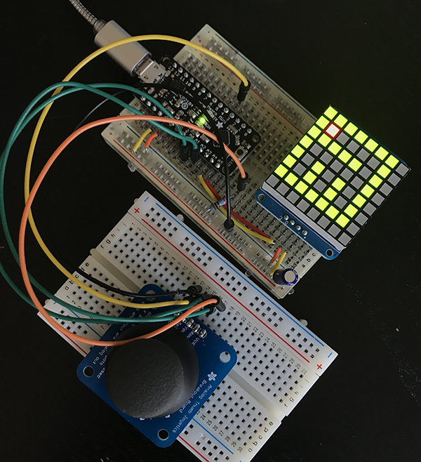

# Adafruit Thumb Joystick and 8x8BiColor Matrix Backpack

  

  Simple Binary Tree maze generation that allows a user to navigate though some simple 3x3 mazes. This is my first rough draft of the code.

  More details and information coming soon!

## License

[UNLICENSED]
